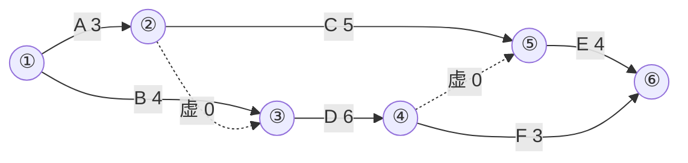

# 网络计划专题（程序员版）

> 这是管理科《进度管理》的核心，也是**实务案例几乎年年考**的题型。
> 对你的好消息：它本质是 **DAG 上的最长路径问题（CPM 关键路径法）**，
> 你已经会 80% 了，剩下 20% 是考试的术语和表达规范。

## 一、翻译对照表：考试术语 ↔ 程序员术语

| 考试术语 | 程序员术语 |
|----------|-----------|
| 双代号网络图 | DAG：**边=工作**，节点=事件（瞬间状态） |
| 单代号网络图 | DAG：**节点=工作**（考试以双代号为主） |
| 紧前/紧后工作 | 前驱/后继 |
| 虚工作（虚箭线，时长 0） | 为满足"一条边唯一标识一项工作"约束而加的纯依赖边 |
| 关键路径 | 源→汇的**最长路径**（决定总工期） |
| 总时差 TF | slack/松弛量：最多能拖多久**不影响总工期** |
| 自由时差 FF | 最多能拖多久**不影响任何紧后工作的最早开始** |

六个时间参数（记号考试通用）：

- **ES / EF**：最早开始 / 最早完成，`EF = ES + D`（D=持续时间）
- **LS / LF**：最迟开始 / 最迟完成，`LS = LF - D`
- **TF = LS - ES = LF - EF**
- **FF = min(紧后工作的 ES) - EF**（无紧后时 FF = 工期 - EF）

计算流程的伪代码（你一眼就懂）：

```text
正推(拓扑序):  ES[v] = max(EF[前驱]);  EF[v] = ES[v] + D[v]     # 源点 ES=0
工期 T      =  max(所有 EF)
逆推(逆拓扑): LF[v] = min(LS[紧后]);  LS[v] = LF[v] - D[v]     # 汇点 LF=T
TF[v] = LS[v] - ES[v]        # TF==0 的连起来就是关键路径
```

三条恒真的性质（选择题爱考）：

1. 关键工作 ⇔ TF = 0；关键路径 = 全由关键工作组成的最长路
2. **FF ≤ TF** 恒成立
3. 关键路径可能不止一条；网络图只有一个起点节点、一个终点节点、无环

## 二、完整例题（考试典型规模，跟着算一遍）

逻辑关系表：

| 工作 | 持续时间(天) | 紧前工作 |
|:---:|:---:|:---:|
| A | 3 | — |
| B | 4 | — |
| C | 5 | A |
| D | 6 | A、B |
| E | 4 | C、D |
| F | 3 | D |

双代号图（虚线为虚工作；能渲染 mermaid 的编辑器里可看图，看不了就按上表理解）：



### 正推（求 ES/EF）

| 工作 | ES | EF | 备注 |
|:---:|:---:|:---:|------|
| A | 0 | 3 | |
| B | 0 | 4 | |
| C | 3 | 8 | 等 A |
| D | **max(3,4)=4** | 10 | 等 A、B 中晚完成者 |
| E | **max(8,10)=10** | 14 | 等 C、D 中晚完成者 |
| F | 10 | 13 | 等 D |

**总工期 T = max(14, 13) = 14 天**

### 逆推（求 LF/LS，从 T=14 倒着来）

| 工作 | LF | LS | 备注 |
|:---:|:---:|:---:|------|
| E | 14 | 10 | |
| F | 14 | 11 | |
| D | **min(10,11)=10** | 4 | 取紧后 E、F 的 LS 较小者 |
| C | 10 | 5 | |
| B | 4 | 0 | |
| A | **min(5,4)=4** | 1 | 取紧后 C、D 的 LS 较小者 |

### 时差与关键路径

| 工作 | TF=LS−ES | FF | 是否关键 |
|:---:|:---:|:---:|:---:|
| A | 1 | 0 | |
| B | **0** | 0 | ★ |
| C | 2 | 2 | |
| D | **0** | 0 | ★ |
| E | **0** | 0 | ★ |
| F | 1 | 1 | |

**关键路径：B → D → E，工期 14 天。**

注意 A：TF=1 但 FF=0——A 拖 1 天总工期没事，但会把紧后工作 C、D 的最早开始
顶后去。这就是 TF（全局松弛）和 FF（局部松弛）的区别，选择题高频陷阱。

## 三、考试怎么考（题型套路）

1. **"关键路径是哪条？工期多少？"** → 正推一遍找最长路即可
2. **"工作 X 拖延 n 天，对总工期什么影响？"** → 拿 n 和 TF 比：
   - n ≤ TF：不影响总工期
   - n > TF：**总工期延长 (n − TF) 天**（案例题常配"是否可索赔工期"一起考）
   - 用上表试算：D 拖 2 天 → D 是关键工作 TF=0 → 工期延长 2 天；
     C 拖 2 天 → TF=2 → 工期不变
3. **补全网络图/找错误** → 记住绘图规则：单起点单终点、无循环、
   节点编号箭尾小于箭头、两节点间不能有两条实箭线（所以才需要虚工作）
4. 实务案例里它常和**费用索赔、赶工压缩**组合出题（后面学到成本章再补充）

## 四、自测

不看上文，独立完成：把例题里 B 的持续时间从 4 改成 2，重算关键路径和工期。

<details>
<summary>点开对答案</summary>

B=2 后：ES_D = max(EF_A, EF_B) = max(3,2) = 3，EF_D=9；
ES_E = max(8,9) = 9，EF_E = 13；EF_F = 12；**工期 13**。
逆推得 TF：A=0、B=1、C=1、D=0、E=0、F=1。
**关键路径变成 A→D→E**（3+6+4=13；原来的关键工作 B 变成了非关键，A 顶了上来）。
——这验证了一个重要性质：**持续时间一变，关键路径会转移**。
赶工类考题就爱考这个：压缩了某关键工作后，别的路径可能变成新的关键路径。

</details>

答对：这个考点你已经毕业，等学到教材对应章节时只需补"画图规范"。
答错：重看第二节的推算表，手算一遍再试。
